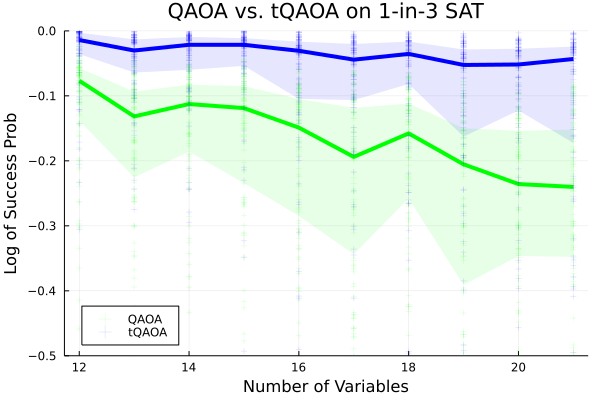
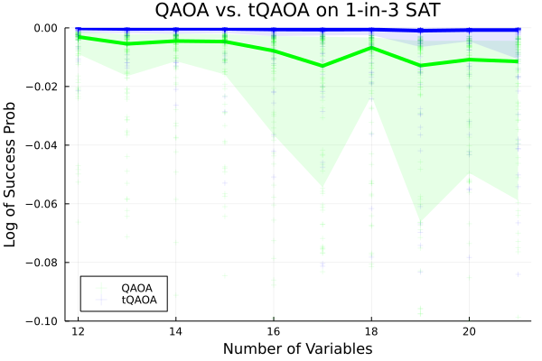

# Increasing Quantum Advantage with Tailored QAOA for 1-in-3 SAT

# Project Overview 

Everyone knows that a suit from a tailor cannot be compared to a suit made off the rack. Tailored algorithms can also be made to perfectly fit problems.  

Following recent results obtained with the Quantum Approximate Optimization Algorithm (`QAOA1`)[[2]](#2) by [Boulebnane and Montanaro](https://arxiv.org/abs/2208.06909)[[3]](#3) showing **quantum advantage**, we empirical benchmark `QAOA1` against a tailored `QAOA` approach on the `1-in-3 SAT` problem, showing **superpolynomial** improvement for an exponential fit on both approaches. 

`B&M` train `QAOA1` on size $12$ instances and benchmark the algorithm for size up to $20$ for different `k-SAT` problems. They compared their results for `8-SAT` to `WalkSAT` and found a slight quantum advantage with $p=60$ (besides theoretical contributions not discussed here).

Specifically, we see the exponent reduce from $0.0214$ to $0.0124$ for $p=14$ ($0.0057$ to $0.0023$), consistent with a quadratic reduction in the runtime and therefore greatly enhancing quantum advantage. 

Other contributions from our work:
- A testbed of `1-in-3 SAT` instances varying from size $12$ to $21$.
- A practical perspective for optimizing `QAOA` parameters.
- Replicable experiments on testbeds.
- Demonstration of applying a tailored ansatz on a feasibility problem.
- Early versions of `GPU` and `CPU` optimized code for such tasks.
- Exploration of an understudied class of optimization problems mendable to Quantum Advantage

# Table of contents
1. [Proposal Details](#propdets)
2. [QAOA1](#qaoa1)
3. [Tailored QAOA](#qaoa2)
4. [Angle Optimization](#optim)
5. [Benchmarks](#benchmarks)
6. [Future Works](#futwork)
7. [References](#refs)


## Proposal Details <a name="propdets"></a>

This Hackathon is work for a future publication based in part on the results gathered here. Our project is about benchmarking an exciting tailored Quantum Alternating Operator Ansatz (`QAOA`)[[1]](#1) approach for solving `1-in-3 SAT`. 

Given the promising recent results obtained with the Quantum Approximate Optimization Algorithm (`QAOA1`)[[2]](#2) by [Boulebnane and Montanaro](https://arxiv.org/abs/2208.06909)[[3]](#3) showing quantum advantage, we wish to understand what computational benefit tailored QAOA can bring on Boolean Satisfiability problems. 

`QAOA` can show massive reductions in the search space considered by quantum devices in place of `QAOA1` by tailoring the mixing and phase-separating operators to smaller subspace[[1]](#1)[[4]](#4). This includes **superpolynomial** reductions in the resulting search space and such a reduction will be seen here as well.

We generate a collection of `1-in-3 SAT` instances of increasing sizes in the phase transition (see below for more details), following the example set by their paper. While they considered `k-SAT` problems, we will see that our approach has a more meaningful impact for `1-in-3 SAT` style problems. 

Primarily, we will train our `QAOA` and `QAOA1` on instances of size `12` within the band of angles prescribed by `B&M` and utilize this to solve instances of increasing size up to `20`. We will implement `CPU` and `CUDA` `GPU` functions in `Julia` to accomplish this task. 

We also use a brute-force solver to find the entire solution space and generate a collection of `1-in-3 SAT` instances in `JSON` that holds essential information about the instances to be able to benchmark our approach. 

# Quantum Approximate Optimization Algorithm for 1-in-3 SAT <a name="qaoa1"></a>

Here we describe `QAOA1` at a high level. Let $\sigma^{0} =(1/2)(Id + \sigma^{z})$, $\sigma^{1} = (1/2)(Id - \sigma^{z})$, and $\alpha, \beta \in \[ 0, 2  \pi \]^{p}$. Then:

```math
    U_{p}(\alpha, \beta) = U_{\text{mixer}}(\beta_{p}) U_{\text{cost}}(\alpha_{p}) \,  \ldots \, U_{\text{mixer}}(\beta_1) \, U_{\text{cost}}(\alpha_1) .
```

The cost of a clause is given by satisfying one literal and unsatisfying the other literals for `1-in-k SAT`:
```math
    H_{\text{clause}} = \text{Id} - \sum_{ (e_{1}, ..., e_{k} ; v_{1}, ..., v_{k} ) } \sum_{i=1}^{k} \sigma_{v_{i}}^{e_{i}} \prod_{j \neq i} \sigma_{v_{j}}^{1 - e_{j}} . 
```

Then the `phase-separating operator`, given a specific $\alpha_{l}$, is just:
```math
    U_{\text{cost}}(\alpha_{l}) = \prod_{\text{clause} \in \text{cost}} e^{i \, \alpha_{l} \, H_{\text{clause}} }
```

Let $|+\rangle_{i}$ represent the `plus` state over qubit $i$. For the `mixing operator`, we have the `X` rotations per qubit for $\beta_{l}$ (written slightly differently than popular as a diffusor):
```math
    U_{\text{mixer}}(\beta_{l}) = \prod_{j=1}^{n} \left( \text{Id} + (e^{-i \, \beta_{l}} - 1) |+\rangle_{j}\langle+|_{j} \right).
```

Notice we place the negative sign for the exponent of the mixing operator and the positive sign for the exponent of the phase-separating operator. 

The initial wavefunction is: 
```math
\ket{\phi(0)} = \ket{+} \ldots \ket{+} = \sum_{x \in \{0,1\}^{n}} \frac{1}{\sqrt{2^{n}}} \ket{x}
```

And so the final wavefunction is:
```math
\ket{\phi(p)} = U_{p}(\alpha, \beta) \ket{\phi(0)}
```


# Tailored Quantum Alternating Operator Ansatz for 1-in-3 SAT <a name="qaoa"></a>

Here we describe our approach at a high level. Given `m` clauses $C = \{ C_{1}, \ldots, C_{m} \}$ over `n` variables $x_{1}, \ldots, x_{n}$, we find the `maximum disjoint set` of clauses over the `n` variables. 

Let $D = \{ K_{D_1}, \ldots, K_{D_{|D|}} \}$ be this set. Let $R = C - D$ be the remaining clauses. Let $N$ be the set of variables not in $D$. 

We find solutions $S_D = \{ S(K_{D_1}), \ldots, S(K_{D_{|D|}}) \}$. Then we use the uniform superposition density operator for each $\hat{S}_{D} = \{ \hat{S(K_{D_1})}, \ldots, \hat{S(K_{D_{|D|}})} \}$. 

Then the phase-separating operator, given a specific $\alpha_{l}$, is reduced to being over the set $R$ instead of $C$:
```math
    U_{\text{cost}}(\alpha_{l}) = \prod_{\text{clause} \in R} e^{i \, \alpha_{l} \, H_{\text{clause}} }
```

For the mixing operator, we have a diffusor associated with each disjoint solution to the $D$ and $\beta_{l}$:
```math
    U_{\text{D}}(\beta_{l}) = \prod_{\hat{S(K)} \in \hat{S}_{D}} \left( \text{Id} + (e^{-i \, \beta_{l}} - 1) \hat{S(K)} \right),
```
and the ordinary single qubit diffusor (`X` rotation) on the variables in $N$:
```math
    U_{\text{N}}(\beta_{l}) = \prod_{j \in N} \left( \text{Id} + (e^{-i \, \beta_{l}} - 1) |+\rangle_{j}\langle+|_{j} \right),
```

Then the overall `mixing operator` is:
```math
    U_{\text{mixer}}(\beta_{l}) = U_{\text{D}}(\beta_{l}) U_{\text{D}}(\beta_{l})
```


# Angle Optimizations over Instances <a name="optim"></a>

With instances of size $12$, we optimize the angles of both approaches in two rounds for `p` set to $14$ and $60$ (following `B&M`).
- Sweep over different starting values for overall coefficient `a` and `b` (10 each) and two choices for evolving
  - Constant: $\alpha = (a, \ldots, a, a), \beta = (b, \ldots, b)$ (`B&M` used this)
  - Linear: $\alpha = (a / p, \ldots, a(p-1)/p, a), \beta = (b, \ldots, 2 b / p, b/p)$
- For each sweep, do `500` rounds of finite difference gradient descent
- Take the best and run `50000` rounds of gradient descent


# 1-in-3 SAT <a name="1in3sat"></a>

Given a collection of `m` clauses, each with $3$ literals, we wish to find an assignment to all `n` variables such that one and exactly one of the literals in each clause is satisfied. So $1$ literal is satisfied and $2$ are unsatisfied for each clause in the collection. 


## Random 1-in-3 SAT instances around the Satisfiability Threshold

The [transition](https://www.researchgate.net/publication/2400280_The_phase_transition_in_1-in-k_SAT_and_NAE_3-SAT) [[5]](#5) from likely to be satisfiable to likely to be unsatisfiable for random `1-in-k` SAT problems occurs with $n/{k \choose 2}$ clauses. For random  `1-in-3` SAT, this occurs with `n/3` clauses. 

# Benchmarks <a name="benchmarks"></a>

We benchmark `QAOA1` and our approach with $p=14$ and $p=60$, following `B&M`, from size $12$ and $21$ with $100$ random instances drawn with $n/3$ clauses and $3$ variables per clause.

## p = 14 QAOA vs Tailored QAOA

Our $p=14$ results show strong performance from both approaches and a soft decay for larger size $n$. In this plot, we label `QAOA1` as `green` and our tailored approach (`tQAOA`) as `blue`. We see a significant uplift from the tailoring!



Fitting an exponential curve on the data with `CurveFit.jl` shows `QAOA` grows as $(0.88)e^{(0.0214)n}$ while `tQAOA` grows as $(0.89)e^{(0.124)n}$.

## p = 60 QAOA vs Tailored QAOA

Our $p=60$ results show expected stronger performance from both approaches over $p=14$. In this plot, we label `QAOA1` as `green` and our tailored approach (`tQAOA`) as `blue`. We see a significant uplift from the tailoring!



Fitting an exponential curve on the data shows `QAOA` grows as $(0.94)e^{(0.0057)n}$ while `tQAOA` grows as $(0.97)e^{(0.0023)n}$.


# Future Work <a name="futwork"></a>

While our focus was on `1-in-3 SAT` during this Hackathon, our code is easily amendable to exploring the same patterns for `1-in-k SAT` problems with different $k$. While our code in `CUDA` works, it requires special optimization to improve and is an exciting direction to push our experiments further. 

# References <a name="refs"></a>

<a id="1">[1]</a> 
Hadfield, S., Wang, Z., O’gorman, B., Rieffel, E. G., Venturelli, D., & Biswas, R. (2019). 
From the quantum approximate optimization algorithm to a quantum alternating operator ansatz. Algorithms, 12(2), 34.

<a id="1">[2]</a> 
Farhi, E., Goldstone, J., & Gutmann, S. (2014). 
A quantum approximate optimization algorithm. arXiv preprint arXiv:1411.4028.

<a id="1">[3]</a> 
Boulebnane, S., & Montanaro, A. (2022). 
Solving boolean satisfiability problems with the quantum approximate optimization algorithm. arXiv preprint arXiv:2208.06909.

<a id="1">[4]</a> 
Leipold, H., Spedalieri, F. M., & Rieffel, E. (2022). 
Tailored Quantum Alternating Operator Ansätzes for Circuit Fault Diagnostics. Algorithms, 15(10), 356.


<a id="3">[5]</a> 
Achlioptas, D., Chtcherba, A., Istrate, G., & Moore, C. (2001, January). 
The phase transition in 1-in-k SAT and NAE 3-SAT. In Proceedings of the twelfth annual ACM-SIAM symposium on Discrete algorithms (pp. 721-722).